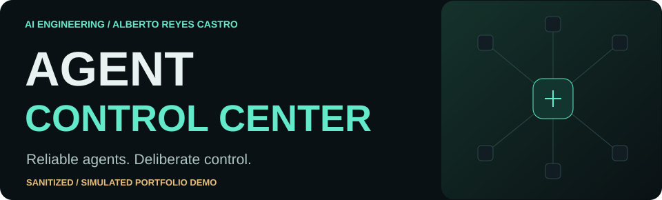
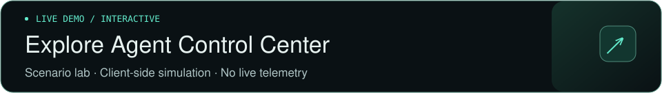
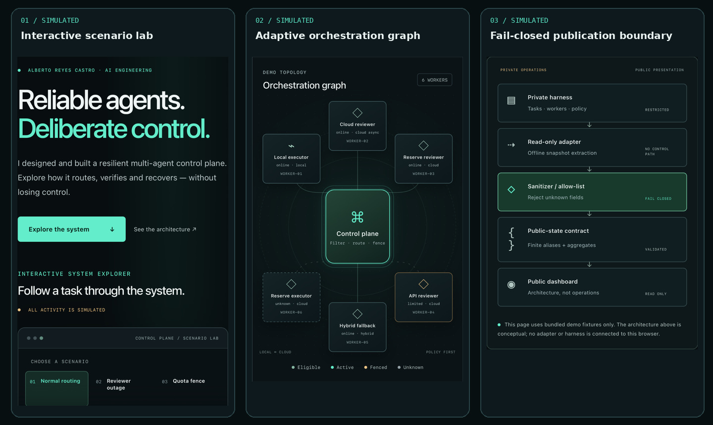
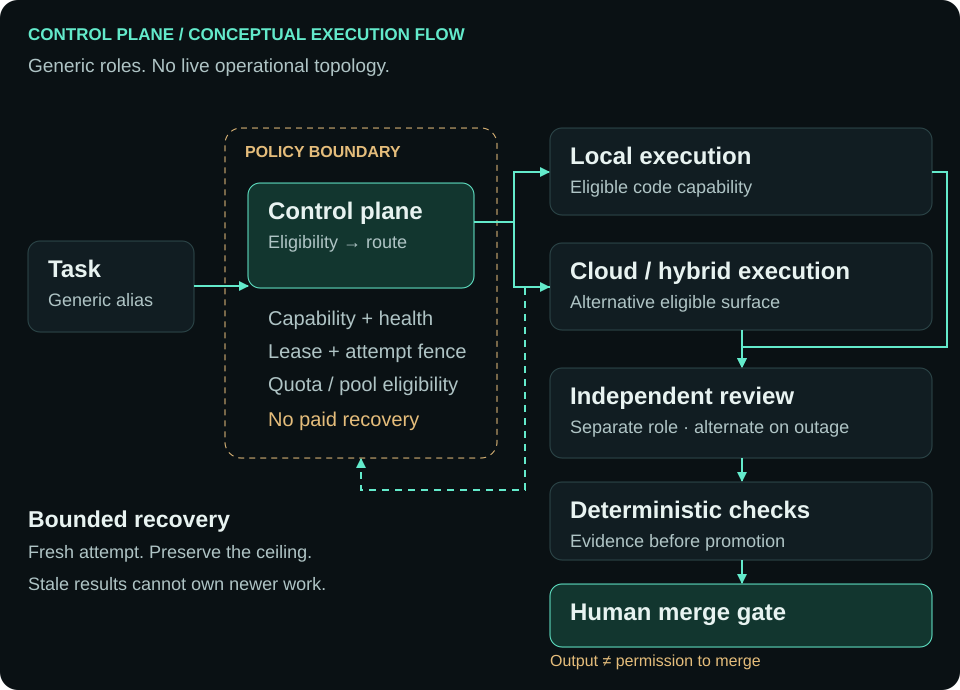
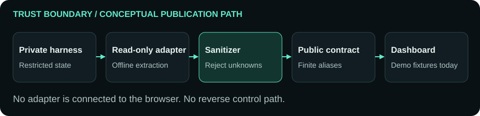

<a href="https://albertoreyescastro.github.io/agent-control-center/">
<picture>
  <source media="(max-width: 600px)" srcset="docs/readme/hero-narrow.svg">
  
</picture>
</a>

<a href="https://albertoreyescastro.github.io/agent-control-center/">
<picture>
  <source media="(max-width: 600px)" srcset="docs/readme/live-demo-narrow.svg">
  
</picture>
</a>

[ARCHITECTURE ↓](#architecture) · [SCENARIOS ↓](#scenarios) · [SECURITY / TRUST MODEL ↓](#security-and-trust-model)

  

# Engineering the space between agents

A public, interactive explanation of a **resilient multi-agent control plane**: capability-aware routing across local and cloud execution, independent verification, bounded recovery and human-controlled promotion.

**SANITIZED / SIMULATED PORTFOLIO DEMO.** Real architectural concepts; authored demo activity. No live telemetry, provider calls or operational access.

[Why I built it](#why-i-built-it) · [Engineering decisions](#engineering-decisions) · [Validation](#validation) · [Run locally](#run-locally) · [Source map](#source-map) · [Limitations](#limitations)

## See it in action

**The product, in three views.** Explore a failure, inspect the route and follow the evidence to the human gate. These cropped mobile captures show the public simulation. Select any preview to open the [Live Demo ↗](https://albertoreyescastro.github.io/agent-control-center/).

<a href="https://albertoreyescastro.github.io/agent-control-center/">
<picture>
  <source media="(max-width: 600px)" srcset="docs/readme/preview-gallery-narrow.jpg">
  
</picture>
</a>

[Interactive scenario lab ↗](https://albertoreyescastro.github.io/agent-control-center/) · [Adaptive orchestration graph ↗](https://albertoreyescastro.github.io/agent-control-center/) · [Fail-closed publication boundary ↗](https://albertoreyescastro.github.io/agent-control-center/)

The screenshots supplement the architecture diagrams below. Activity is authored and simulated; the publication boundary is conceptual, with no harness connected to the browser.

## Why I built it

An agent can produce useful work and still be the wrong owner of a task. Workers disappear, review providers become unavailable, results arrive late and quota runs out. Recovery needs more than another prompt.

I built this project to make those coordination problems visible: **who is eligible, who owns an attempt, which evidence is required, and where automation must stop**. The public interface lets you explore those decisions without exposing the operational system.

Designed and built by **Alberto Reyes Castro** as an AI engineering portfolio project. Architecture, state transitions, failure boundaries and evidence are documented so the engineering can be inspected and discussed. AI agents are tools in the development workflow; this demo does not claim measured cross-provider review independence.

## Architecture

**Conceptual architecture, not an exact operational inventory.** Generic roles show the route from a task to a human decision. Local and cloud workers are alternative eligible execution surfaces; review is a separate role.

<a href="https://albertoreyescastro.github.io/agent-control-center/#architecture">
<picture>
  <source media="(max-width: 600px)" srcset="docs/readme/control-plane-narrow.svg">
  
</picture>
</a>

**Task → eligibility → route → fenced execution → separate review → deterministic checks → human merge gate.** Failure can change the worker or attempt; it must preserve capability, ownership, verification and spend policy.

The browser illustrates this flow with finite fixtures. It does not implement a queue service, schedule real workers or perform provider-backed review.

## Scenarios

**Six local simulations. One closed human gate.** [Open the scenario lab ↗](https://albertoreyescastro.github.io/agent-control-center/#lab), select a story, then play, pause or step through its decisions. Inspect any worker by hover, tap or keyboard focus; reset returns to the selected story's start.

| Scenario | What the decision demonstrates |
| :-- | :-- |
| **01 · Normal routing** | Match an eligible executor; keep execution, review and verification separate. |
| **02 · Reviewer outage** | Replace an unavailable reviewer while preserving the independent review role. |
| **03 · Quota fence** | Select an eligible alternate pool; never imply paid recovery. |
| **04 · Heartbeat lost** | Stale or unknown health removes eligibility; select a fresh owner. |
| **05 · Bounded recovery** | Preserve the illustrated two-attempt ceiling; reject late ownership from an older attempt. |
| **06 · Independent verification / human merge gate** | Require separate review and deterministic checks, then stop at a closed human gate. |

Task packets follow the active execution/review path. Inspector, metrics and timeline share the same scenario state. Pausing stops motion; reduced-motion preferences are respected. Changing stories cancels prior timers.

## Engineering decisions

| Concern | Design principle illustrated |
| :-- | :-- |
| **Capability-aware routing** | Filter capability, execution surface, health and policy before selecting a worker. |
| **Durable queue / ownership** | Queue state outlives a worker; one claimed attempt has one owner. The public queue view is simulated. |
| **Leases / heartbeats** | Heartbeats inform eligibility. Lease and attempt fences reject stale ownership and late completions. |
| **Circuit breakers / retries** | Fence unavailable paths; preserve attempt counters and stop at the retry ceiling. |
| **Quota / spend safety** | Pool eligibility constrains fallback. Unknown quota stays **Not observable**; recovery does not authorize paid overage, refill or reset. |
| **Independent verification** | A separate review role and deterministic checks precede promotion. Cross-family diversity is a design goal, not a measured demo outcome. |
| **Human authority** | A verified result is not permission to merge. The public page exposes no write or admin action. |

<details>
<summary><strong>Observability philosophy: show decisions, preserve uncertainty</strong></summary>

The UI presents generic worker aliases, finite health states and a coherent decision timeline. It deliberately avoids displaying private task content. Missing or unobservable information stays unknown instead of becoming a green status by inference.

The control plane separates availability, ownership, evidence and authority. A recovered route still needs review; a passing check still needs human approval. The topology is an explanation of those boundaries, not a live operational map.

</details>

## Security and trust model

**Visibility does not require operational access.** The publication architecture has a one-way data boundary:

<picture>
  <source media="(max-width: 600px)" srcset="docs/readme/trust-boundary-narrow.svg">
  
</picture>

**Private harness → read-only adapter → sanitizer / allow-list → public-state contract → public dashboard.** Read-only extraction and sanitization happen upstream, outside this public browser. No live adapter is connected today.

- The [public contract](public-state.schema.json) admits finite aliases, enums and bounded aggregates. Unknown fields and unrestricted operational text fail closed.
- The browser uses bundled demo fixtures, text-only DOM rendering and a strict CSP including `connect-src 'none'`. It never connects to the private harness.
- Malformed demo state disables simulation controls. Health and quota are never represented as measured live data.
- Credentials, private prompts/responses, task payloads, raw logs, internal endpoints, private paths and account/billing identifiers must never enter this repository or its visual assets.

Read [SECURITY.md](SECURITY.md) before changing public fields. If you discover sensitive content, contact the owner privately; do not reproduce it in a public issue. Pattern scanning cannot prove the absence of deliberately encoded secrets, so source review remains essential.

## Validation

The repository's [read-only validation workflow](.github/workflows/validate.yml) checks the public boundary and simulation before real-browser QA. Actions are pinned; checkout credentials are not persisted. There is no Pages deployment workflow in this repository.

| Evidence | Existing V2 baseline |
| :-- | :-- |
| Privacy / schema regressions | **20 tests passed**; duplicate keys, malformed values, unsafe sinks and leakage cases. |
| Deterministic simulation | **440 assertions passed** across all six scenario sequences. |
| DOM behavior | **39 transitions passed**, plus stale timers, focus/hover, reduced motion and fail-closed behavior. |
| Real Chrome QA | All six scenarios at **1440 / 1024 / 768 / 390 / 320 px**; keyboard, touch, hover and reduced motion passed. |
| Layout / runtime | Zero horizontal overflow, clipped worker nodes, console/runtime errors or broken assets in the recorded run. |

These are test results, not production reliability metrics. See the [recorded V2 CI run](https://github.com/albertoreyescastro/agent-control-center/actions/runs/37053572034), [current workflow runs](https://github.com/albertoreyescastro/agent-control-center/actions/workflows/validate.yml) and [validation evidence](VALIDATION.md). The V2 checkpoint documents its pre-merge test state; current main contains the merged V2 interface.

<details>
<summary><strong>Run the deterministic checks</strong></summary>

```bash
python -B scripts/validate_public.py
python -B -m unittest discover -s tests -v
node --check assets/app.js
node --check assets/demo-state.js
node --check assets/simulation.js
node tests/simulation.cjs
node tests/dom-smoke.cjs
```

The public scanner rejects unknown files, symlinks, oversized content, unapproved binary files and credential/private-identifier patterns. The two screenshot composites are explicitly allow-listed and byte-fenced after visual and OCR privacy review; any pixel or metadata change requires a new review. It scans its own source. CI uses a hash-locked browser driver in temporary storage and Chrome already present on the hosted runner; the driver is not shipped to the website.

</details>

## Run locally

**No build step, framework, runtime package installation or CDN.** Serve this static repository on loopback:

```bash
python -m http.server 8000 --bind 127.0.0.1
```

Open the loopback address on port 8000. JavaScript enables the local simulation; architecture and source links remain available without it. No provider authentication is needed.

## Source map

| Location | Responsibility |
| :-- | :-- |
| [index.html](index.html) · [styles.css](assets/styles.css) | Semantic static UI, responsive layout and motion styling. |
| [app.js](assets/app.js) · [simulation.js](assets/simulation.js) | Inspection/playback and finite scenario state transitions. |
| [demo-state.js](assets/demo-state.js) · [public-state.schema.json](public-state.schema.json) | Bundled sanitized fixture and closed public contract. |
| [scripts/](scripts) | Contract validation and public inventory/leakage checks. |
| [tests/](tests) | Python regressions, Node simulation/DOM checks and Chrome QA. |
| [docs/readme/](docs/readme) | First-party static README visuals; no scripts or remote assets. |
| [SECURITY.md](SECURITY.md) · [VALIDATION.md](VALIDATION.md) | Publication boundary and recorded technical evidence. |

**Stack:** HTML, CSS, vanilla JavaScript and SVG for the product; Python and Node for deterministic validation; GitHub Actions and a locked Playwright driver for browser QA. No heavyweight frontend framework.

## Limitations

This is an architecture and reliability demo, not an operational console. It exposes no real providers, worker inventory, prompts, responses, private tasks, measured quota or control-plane endpoints. Play, step and reset change authored client-side state only.

The public schema supports a future upstream sanitized snapshot, but no live feed is connected. Provider-side included-only eligibility and spend controls require verification outside this dashboard. The demo cannot establish actual billing state or production failover reliability.

Recorded browser QA covers Chrome. Firefox, Safari and a complete screen-reader/accessibility conformance audit remain unperformed. This README uses static SVGs because GitHub does not support SVG animation; the live experience provides the richer interaction.

---

**Alberto Reyes Castro · AI engineering**  
[Explore the live system ↗](https://albertoreyescastro.github.io/agent-control-center/) · [Inspect the source](https://github.com/albertoreyescastro/agent-control-center) · [Review the trust model](SECURITY.md)
